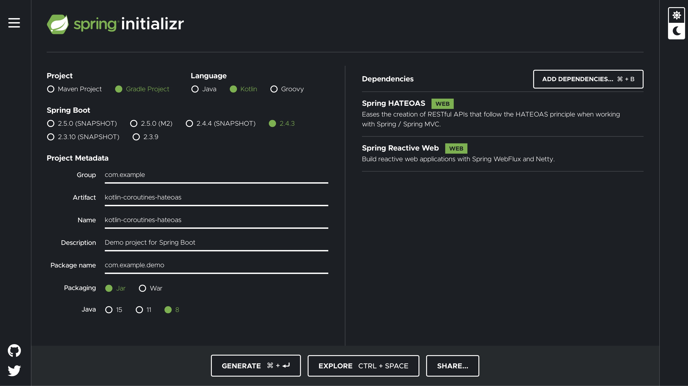

:spring_version: current
:spring_boot_version: 2.2.2.RELEASE
:Controller: https://docs.spring.io/spring/docs/{spring_version}/javadoc-api/org/springframework/stereotype/Controller.html
:DispatcherServlet: https://docs.spring.io/spring/docs/{spring_version}/javadoc-api/org/springframework/web/servlet/DispatcherServlet.html
:SpringApplication: https://docs.spring.io/spring-boot/docs/{spring_boot_version}/api/org/springframework/boot/SpringApplication.html
:ResponseBody: https://docs.spring.io/spring/docs/{spring_version}/javadoc-api/org/springframework/web/bind/annotation/ResponseBody.html
:toc:
:icons: font
:source-highlighter: prettify
:project_id: gs-kotlin-coroutines-hateoas

This guide walks you through the process of creating a “Hello, World” Hypermedia-driven REST web service with Spring and https://kotlinlang.org/docs/coroutines-overview.html[Kotlin Coroutines].

Hypermedia is an important aspect of REST. It lets you build services that decouple client and server to a large extent and let them evolve independently. The representations returned for REST resources contain not only data but also links to related resources. Thus, the design of the representations is crucial to the design of the overall service.

== What you'll build

//TODO

== What you'll need

:java_version: 1.8
include::https://raw.githubusercontent.com/spring-guides/getting-started-macros/master/prereq_editor_jdk_buildtools.adoc[]

include::https://raw.githubusercontent.com/spring-guides/getting-started-macros/master/how_to_complete_this_guide.adoc[]

[[scratch]]
== Starting with Spring Initializr

If you use Maven, visit the https://start.spring.io/#!type=maven-project&language=kotlin&platformVersion=2.4.3.RELEASE&packaging=jar&jvmVersion=11&groupId=com.example&artifactId=kotlin-coroutines-hateoas&name=kotlin-coroutines-hateoas&description=Demo%20project%20for%20Spring%20Boot&packageName=com.example.demo&dependencies=hateoas,webflux[Spring Initializr] to generate a new project with the required dependency (Spring WebFlux and HATOAS).

The following listing shows the `pom.xml` file created when you choose Maven:

====
[source,xml]
----
include::initial/pom.xml[]
----
====

If you use Gradle, visit the https://start.spring.io/#!type=gradle-project&language=kotlin&platformVersion=2.4.3.RELEASE&packaging=jar&jvmVersion=11&groupId=com.example&artifactId=kotlin-coroutines-hateoas&name=kotlin-coroutines-hateoas&description=Demo%20project%20for%20Spring%20Boot&packageName=com.example.demo&dependencies=hateoas,webflux[Spring Initializr] to generate a new project with the required dependency (Spring Web and HATEOAS).

The following listing shows the `build.gradle.kts` file created when you choose Gradle:

====
[source,gradle]
----
include::initial/build.gradle.kts[]
----
====

== Exclude transitive dependencies

How do I exclude specific transitive dependencies of something I depend on?

The `spring-boot-starter-hateoas` dependency have a transitive dependency to `spring-boot-starter-web` who will provide a `Tomcat Server`. In case to use a `Netty Server` from the `spring-boot-starter-webflux` dependencies we have to exclude the transitive dependency from the `spring-boot-starter-hateoas`. To get done this job we have to modify the `pom.xml` file like beloved.

[source,xml]
.pom.xml
----
include::complete/pom.xml[tags=exclude-web]
----

In case of the `gradle` project :
[source,groovy]
.build.gradle.kts
----
include::complete/build.gradle.kts[tags=exclude-web]
----

== Enable HATEOAS
To enable the `HATEOAS` we have defined the `WebStack.WEBFLUX`, and the type of `HypermediaType.HAL` this can be done with the following annotation.
[source,kotlin]
.DemoApplication.kt
----
include::complete/src/main/kotlin/com/example/demo/DemoApplication.kt[tags=enableHATEOAS]
----

== Create Index (Root) Resource

[source,kotlin]
.IndexResource.kt
----
include::complete/src/main/kotlin/com/example/demo/index/IndexResource.kt[tags=indexResource]
----

== Try it out

//TODO

== Summary

//TODO

include::https://raw.githubusercontent.com/spring-guides/getting-started-macros/master/footer.adoc[]

