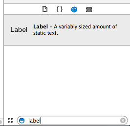
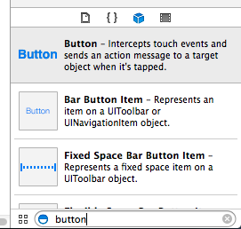
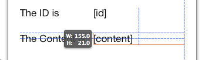
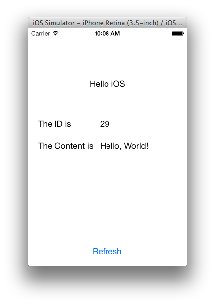

:spring_version: current
:spring_boot_version: 1.4.0.RELEASE
:Controller: http://docs.spring.io/spring/docs/{spring_version}/javadoc-api/org/springframework/stereotype/Controller.html
:DispatcherServlet: http://docs.spring.io/spring/docs/{spring_version}/javadoc-api/org/springframework/web/servlet/DispatcherServlet.html
:SpringApplication: http://docs.spring.io/spring-boot/docs/{spring_boot_version}/api/org/springframework/boot/SpringApplication.html
:ResponseBody: http://docs.spring.io/spring/docs/{spring_version}/javadoc-api/org/springframework/web/bind/annotation/ResponseBody.html
:toc:
:icons: font
:source-highlighter: prettify
:project_id: draft-gs-template
This guide walks you through building a simple iOS client in Swift 3 that consumes a Spring MVC-based link:/understanding/REST[RESTful web service].

== What you'll build

You will build an iOS client using Swift 3 that consumes a Spring-based RESTful web service.
Specifically, the client will consume the service created in {gs-rest-service}[Building a RESTful Web Servce].

The iOS client will be accessed through the iOS Simulator, and will consume the service accepting requests at:

    http://rest-service.guides.spring.io/greeting

The service will respond with a link:/understanding/JSON[JSON] representation of a greeting:

[source,json]
----
{"id":1,"content":"Hello, World!"}
----

The iOS client will render the ID and content into a view.

== What you'll need

 - About 15 minutes
 - A Mac with OS X
 - Xcode 8
 - An internet connection

== Create an iOS Project

Within Xcode, create a new project, using the "Single View Application" template. If you prefer, you can use the project in the `initial` folder and skip ahead to <<initial>>. When you are finished, you can compare your code to the `complete` folder and <<run>>.

image::http://bit.ly/2bOCVhS[Create new Single View Application Project]

Choose the following options for the new project. These are the same values used in the sample code. Note that `Swift` is selected in the Language drop down menu.

image::http://bit.ly/2bODoQZ[Choose options for the new project]

When the project is created, you will see that several files are added. To complete this guide, you will edit `Main.storyboard`, `ViewController.swift`, and `Info.plist`

image::http://bit.ly/2bOCTXa[View the Xcode project contents]

[[initial]]
== Modifying App Transport Security (ATS)
http://apple.co/2buRByd[App Transport Security] is a security measure which defaults to blocking non-HTTPS network traffic. We will add exceptions inside the info.plist file. When the project is first created by the wizard, the content of the Info.plist file is like this:

image::http://bit.ly/2buSVRH[Default Info.plist file]

We will add 3 dictionaries, one under another, and set two parameters to TRUE. In this guide, "localhost" is defined as the RESTful server but if you use another, feel free to change it accordingly. Here is the eventual state:

image::http://bit.ly/2buUz5N[Info.plist with exceptions]

== Creating the ViewController

The Model-View-Controller design pattern (MVC) is used extensively in iOS applications. As the name implies, a ViewController controls the view. When you created the project, the `ViewController.swift` was also created with an almost empty implementation. 

First, modify that file to include two properties, and two methods.

`SpringRestController/ViewController.swift`
[source,swift]
----
include::complete/SpringRestController/ViewController.swift[]
----
    
The `greetingId` and `greetingContent` properties are `UILabel` types. These properties are declared with the type qualifier of `IBOutlet`. By declaring these as an `IBOutlet`, they can easily be connected to the view. Note how the `fetchGreeting` method is also declared with a type qualifier, in this case `IBAction`. Like the properties, this allows the method to be connected to a control in the view, for example a button.

There are four methods in the main class file, `getGreeting`, `parseJson`, `viewDidLoad`, and `didReceiveMemoryWarning`. `ViewController` inherits from `UIViewController`, and `viewDidLoad` and `didReceiveMemoryWarning` override the default implementations. `viewDidLoad` is modified so that `getGreeting` is called when the view is first loaded. `didReceiveMemoryWarning` is included for consistency with the default class template used when creating a new project, but otherwise it is unused in this guide.

The `getGreeting` method is where the HTTP request happens. It uses `URLSession.shared.dataTask` to send an asynchronous request to the specified URL. This particular method makes use of a Swift construct called a "closure". In this case, the closure is passed to the `completionHandler` method parameter, meaning that on completion of the HTTP request, the code within the block is executed.

If data is received and there is not an error when the HTTP request completes, `parseJson` is called, where ` JSONSerialization.jsonObject` is used to read the data into an `[String: AnyObject] Dictionary`. Once the data is available in a dictionary, the "id" and "content" values are retrieved and assigned to the two labels that are defined.

== Creating the View

Select the `main.storyboard` from the project navigator on the left side of the Xcode window. A Storyboard contains the layout for the view. 

image::images/select-storyboard.png[Select main.storyboard]

Xcode provides a WYSIWYG editor for creating views. This editor is often referred to as Interface Builder because, historically, it was a separate application. You will now see the layout for the `RestViewController`. If you created a new project yours is empty.

image::images/view-storyboard.png[View main.storyboard]

In the bottom right corner of Xcode select and drag two `Label` objects to the storyboard layout. You can filter the list of objects using the field at the bottom. You will use the first label to display the Greeting's ID, and the second for the Greeting's content. If you created a new project follow these same steps to add three more labels (five total).

Next, select and drag a `Button` object to the storyboard layout. This button will be used to refresh the content by making additional HTTP requests to the REST service.

Double-click one label and change it to "[id]", and the other to "[content]". This will be the placeholder text. These values will be replaced on successful completion of the HTTP request as described in "Create a ViewController" section. For new projects, modify the other three labels to read "Hello iOS", "The ID is", and "The Content is". Lastly, double-click the button to change it to read "Refresh".

Using the editor, you can move these labels around the storyboard to look similar to the following:

image::images/complete-storyboard.png[View complete storyboard]

The content and id returned from the RESTful service may be longer than the label widths allow. Resize the width of the "[id]" and "[content]" labels to accommodate larger string values.

Now that you have all the UI objects on the storyboard, you can associate those objects with the properties in the `RestViewController`. The terminology used within Xcode is adding a new referencing outlet. Control-click the "id" label. Select the circle next to the "New Referencing Outlet" and drag it to the "Rest View Controller" icon. All the properties which are declared with the `IBOutlet` type modifier are listed. Select the `greetingId` to complete the association.

image::images/greetingId-outlet1.png[Select new referencing outlet for id label]

image::images/greetingId-outlet2.png[Select new referencing outlet for id label]

Repeat these same steps for the "content" label, this time selecting the `greetingContent` as the "New Referencing Outlet".

image::images/greetingContent-outlet1.png[Select new referencing outlet for content label]

image::images/greetingContent-outlet2.png[Select new referencing outlet for content label]

The final task is to add a referencing outlet for the button. In this case you will associate a button event with the `fetchGreeting` method in the `RestViewController`, which is declared with the `IBAction` type modifier.

image::images/fetchGreeting-outlet1.png[Select new referencing outlet for refresh button]

image::images/fetchGreeting-outlet2.png[Select new referencing outlet for refresh button]

[[run]]
== Running the client

You can now run the app from Xcode. To do this, click the play button (triangle) in the top left corner of Xcode. It will open in the iOS simulator, where you see:

The ID value will increment each time you click the refresh button.

If the simulator window is too large for your display, you can reduce its size by selecting a scaled view of it:

image::images/scale-simulator.png[Scale simulator]

== Summary

Congratulations! You've just developed an iOS client that consumes a Spring-based RESTful web service.

include::https://raw.githubusercontent.com/spring-guides/getting-started-macros/master/footer.adoc[]
